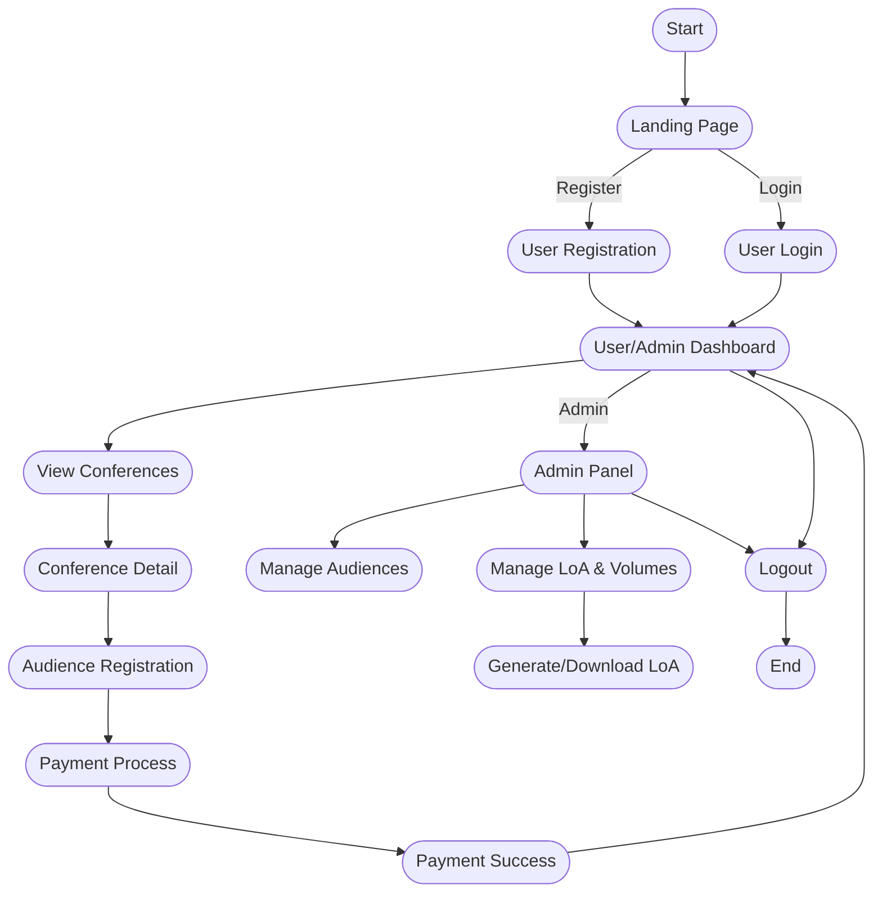
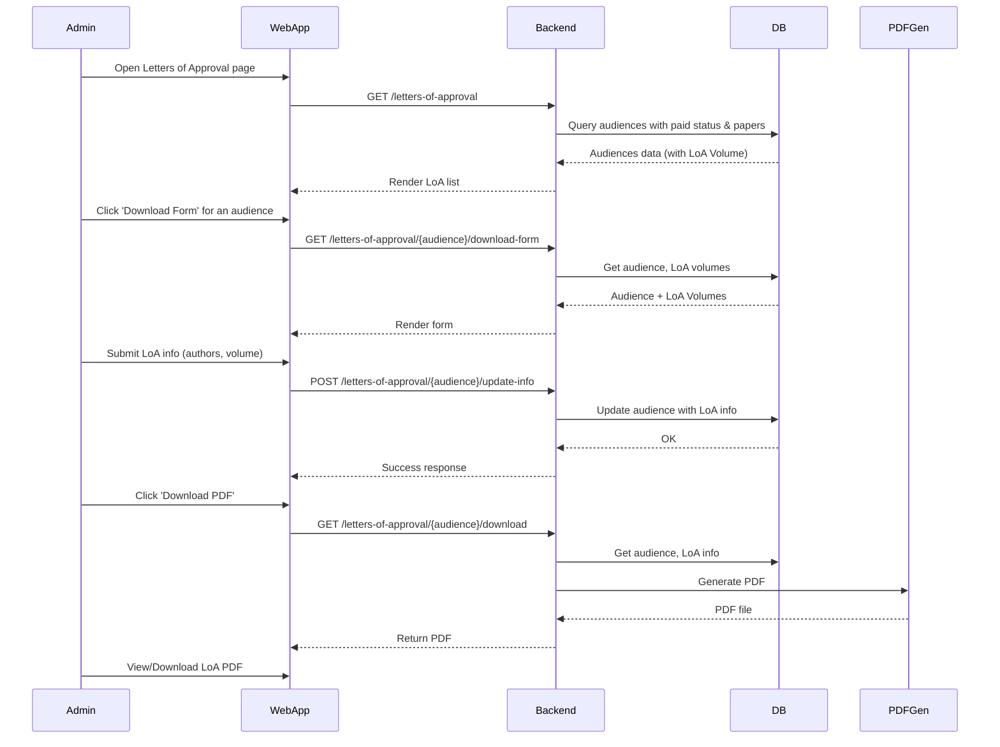

# Conference Management Application - Documentation

## Overview
A web-based conference management system for handling conference registration, audience management, LoA (Letter of Approval) generation, payment integration, and admin features. Built with Laravel (backend) and React (frontend, Mantine UI, PrimeReact, Inertia.js).

---

## Main Features
- Conference CRUD (admin)
- Audience registration & management
- Keynote & parallel session management
- Payment integration (PayPal, Bank Transfer)
- Letters of Approval (LoA) management
- LoA Volume management (admin)
- Admin dashboard & statistics
- Search, filter, pagination on all major lists
- Role-based access (admin, user)

---

## User Flow Chart

---

## Sequence Diagram: LoA Generation (Admin)

---

## How It Works (Summary)

- **User** dapat mendaftar, login, melihat daftar konferensi, dan melakukan registrasi sebagai audience.
- **Pembayaran** dilakukan via PayPal atau transfer bank, diverifikasi oleh admin.
- **Admin** dapat mengelola data conference, audience, keynote, parallel session, dan LoA Volume.
- **LoA** dapat di-generate untuk audience yang sudah membayar dan mengisi data paper.
- **LoA Volume** dikelola terpisah, audience dapat di-assign ke volume tertentu.
- **Semua list** (audience, LoA, volume, dsb) mendukung pencarian, filter, dan pagination.
- **PDF LoA** dihasilkan secara otomatis dan dapat diunduh oleh admin.

---

## Tech Stack
- **Backend:** Laravel (PHP)
- **Frontend:** React (TypeScript), Mantine UI, PrimeReact, Inertia.js
- **Database:** MySQL/PostgreSQL
- **PDF:** DomPDF
- **Payment:** PayPal API

---

## For Developers
- Ikuti struktur folder dan pola coding yang sudah ada.
- Semua fitur baru harus konsisten dengan UI/UX dan arsitektur project.
- Lihat `.github/agents/instruction.md` untuk instruksi pembuatan fitur baru.
