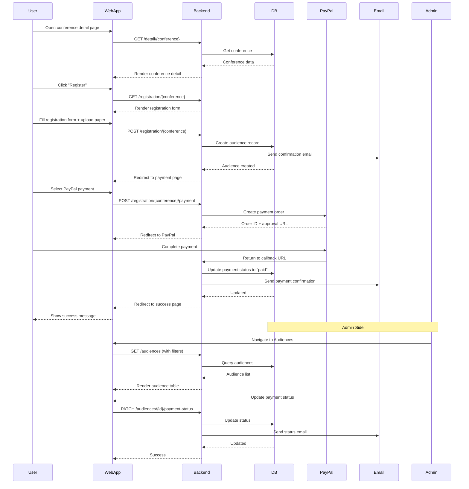

# Audience Registration & Management Feature

## Description

Public users can register for conferences, while admins can view, manage, and verify audience registrations and payments.

## Key Features

- Public registration form
- Payment integration (PayPal, Bank Transfer)
- Payment status management
- Search and filter audiences
- Export audience data to Excel
- Download payment receipts
- View audience details and papers

## Sequence Diagram



## User Flow

### Public Registration

1. User visits conference detail page
2. Click register button
3. Fill registration form (name, institution, paper title, etc.)
4. Upload full paper (PDF)
5. Select presentation type and payment method
6. Process payment via PayPal or bank transfer
7. Receive confirmation email

### Admin Management

1. Admin logs in
2. Navigate to Audiences menu
3. View list with filters (conference, payment method, payment status)
4. Search by name, email, institution
5. View audience details
6. Update payment status (for bank transfer)
7. Download payment receipt
8. Export data to Excel

## Technical Implementation

### Backend

- **Controller:** `app/Http/Controllers/Admin/AudiencesController.php`
- **Public Controller:** `app/Http/Controllers/RegistrationController.php`
- **Model:** `app/Models/Audience.php`
- **Routes:**
  - Admin: `/audiences` (resourceful)
  - Public: `/registration/{conference}`
- **Validation:** Name, email, paper required; phone validation with regex

### Frontend

- **Admin Pages:** `resources/js/Pages/Admin/Audiences/`
  - `Index.tsx` - List with search, filter, pagination
  - `Show.tsx` - Detail view
  - `Edit.tsx` - Edit form
- **Public Pages:** `resources/js/Pages/Registration/`
  - `Create.tsx` - Registration form
  - `Payment.tsx` - Payment selection
  - `Success.tsx` - Success page

### Database

- **Table:** `audiences`
- **Key Fields:**
  - Personal: first_name, last_name, email, phone_number, institution, country
  - Paper: paper_title, full_paper_path
  - Payment: payment_status, payment_method, paid_fee
  - LoA: loa_status, loa_authors, loa_volume_id
- **Relationships:**
  - `belongsTo(Conference)`
  - `belongsTo(LoaVolume)`
  - `hasMany(KeyNote)`
  - `hasMany(ParallelSession)`
- **Soft Deletes:** Yes

## Payment Integration

### PayPal Flow

1. User selects PayPal as payment method
2. Backend creates PayPal order via API
3. User redirected to PayPal for payment
4. After payment, PayPal redirects to return URL
5. Backend captures payment and updates status
6. Confirmation email sent automatically

### Bank Transfer Flow

1. User selects bank transfer
2. Upload payment proof
3. Admin verifies payment manually
4. Admin updates payment status to "paid"
5. Confirmation email sent

## Export & Download

### Export to Excel

- All audiences or filtered subset
- Includes all audience data and payment info
- Format: XLSX via Maatwebsite/Excel package

### Download Receipt

- PDF receipt for paid audiences
- Includes conference details, payment amount, date
- Generated via DomPDF

## Common Operations

### Create Registration

```php
POST /registration/{conference}
- first_name, last_name (required)
- email (required, unique per conference)
- phone_number (regex validation)
- institution, country
- paper_title, full_paper_path (file)
- presentation_type, payment_method
```

### Update Payment Status

```php
PATCH /audiences/{id}/payment-status
- payment_status (pending_payment, paid, failed, refunded, cancelled)
- Sends email notification
```

### Search & Filter

```php
GET /audiences?search={term}&conference_id={id}&payment_status={status}
- Multi-field search (name, email, institution, paper title)
- Filter by conference, payment method, payment status
- Server-side pagination (15/25/50 per page)
```
