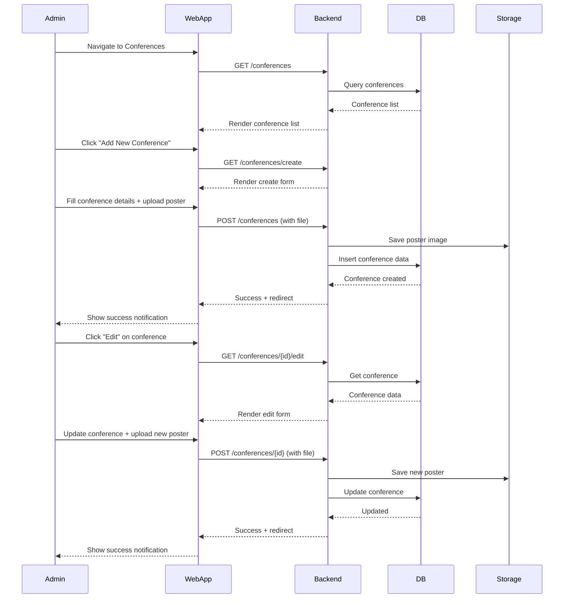

# Conference Management Feature

## Description

Admin can create, view, edit, and manage conferences including conference details, settings, rooms, and certificates.

## Key Features

- CRUD operations for conferences
- Upload conference cover/poster
- Configure registration dates, fees, and location
- Manage multiple rooms for each conference
- Upload certificate templates
- Soft delete with restore capability

## Sequence Diagram



## User Flow

1. Admin logs in
2. Navigate to Conferences menu
3. View list of all conferences with search/filter
4. Create new conference with details (name, date, location, fees, rooms)
5. Upload conference poster
6. Configure registration dates
7. Edit/update conference as needed
8. Delete or restore conferences (soft delete)

## Technical Implementation

### Backend

- **Controller:** `app/Http/Controllers/Admin/ConferencesController.php`
- **Model:** `app/Models/Conference.php`
- **Routes:** `/conferences` (resourceful routes)
- **Validation:** Name, date, fees required; poster must be image

### Frontend

- **Pages:** `resources/js/Pages/Admin/Conferences/`
  - `Index.tsx` - List view with search/filter
  - `Create.tsx` - Create form
  - `Edit.tsx` - Edit form
  - `Show.tsx` - Detail view
- **Components:** Card layout, file upload, date picker, fee inputs

### Database

- **Table:** `conferences`
- **Key Fields:** id, name, description, initial, date, city, country, fees (online/onsite/participant), cover_poster_path
- **Relationships:**
  - `hasMany(Audience)` - audiences registered
  - `hasMany(Room)` - conference rooms
- **Soft Deletes:** Yes

## Common Operations

### Create Conference

```php
POST /conferences
- name (required)
- description
- initial (required)
- date (required)
- registration_start_date
- registration_end_date
- city, country
- online_fee, onsite_fee, participant_fee
- cover_poster_path (file upload)
```

### Update Conference

```php
POST /conferences/{id}
- Same fields as create
- Method spoofing: _method=PUT
```

### Delete Conference

```php
DELETE /conferences/{id}
- Soft delete (deleted_at timestamp)
```

### Restore Conference

```php
PUT /conferences/{id}/restore
- Restore soft-deleted conference
```
