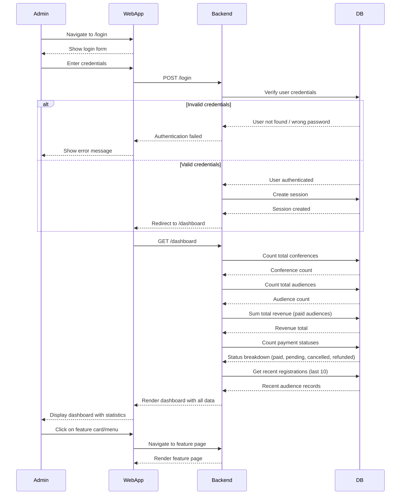
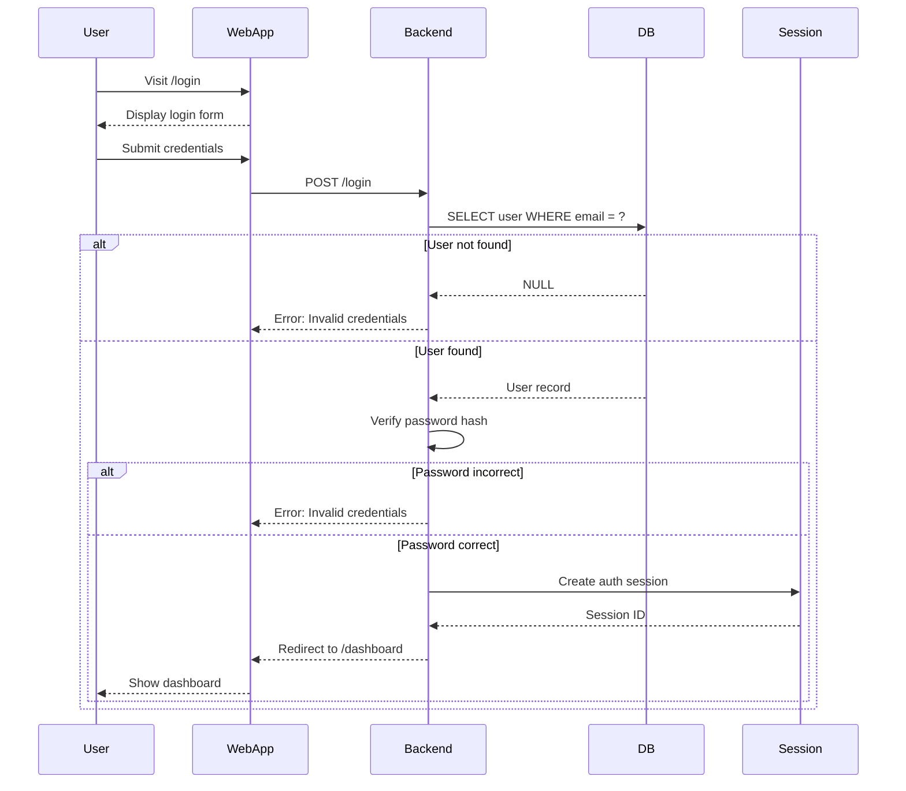
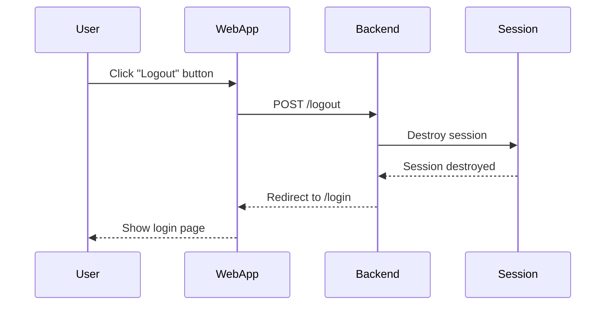

# Dashboard & Statistics Feature

## Description

Admin dashboard showing overview statistics, summaries, and quick access to main features.

## Key Features

- Total conferences count
- Total audiences count
- Total revenue/payments
- Payment status breakdown
- Recent registrations
- Quick navigation to features
- Summary cards with icons
- Responsive layout

## Sequence Diagram



## User Flow

1. Admin navigates to login page
2. Enter username/email and password
3. Click "Login" button
4. System validates credentials
5. On success, redirect to dashboard
6. View summary statistics:
   - Total conferences
   - Total audiences
   - Total revenue
   - Payment breakdown
7. View recent registrations table
8. Click on menu items to navigate to features
9. Use quick action cards if available

## Technical Implementation

### Backend

- **Controller:** `app/Http/Controllers/Admin/DashboardController.php`
- **Routes:**
  - `GET /dashboard` - Main dashboard
- **Authentication:** Laravel session-based auth with middleware

#### Dashboard Data Aggregation

```php
public function index()
{
    $totalConferences = Conference::whereNull('deleted_at')->count();
    $totalAudiences = Audience::count();
    $totalRevenue = Audience::where('payment_status', 'paid')->sum('paid_fee');

    $paymentBreakdown = [
        'paid' => Audience::where('payment_status', 'paid')->count(),
        'pending' => Audience::where('payment_status', 'pending_payment')->count(),
        'cancelled' => Audience::where('payment_status', 'cancelled')->count(),
        'refunded' => Audience::where('payment_status', 'refunded')->count(),
    ];

    $recentRegistrations = Audience::with('conference')
        ->latest()
        ->take(10)
        ->get();

    return Inertia::render('Admin/Dashboard/Index', [
        'totalConferences' => $totalConferences,
        'totalAudiences' => $totalAudiences,
        'totalRevenue' => $totalRevenue,
        'paymentBreakdown' => $paymentBreakdown,
        'recentRegistrations' => $recentRegistrations,
    ]);
}
```

### Frontend

- **Page:** `resources/js/Pages/Admin/Dashboard/Index.tsx`
- **Layout:** `resources/js/Layout/MainLayout.tsx`
- **Components:**
  - Summary cards with Mantine Card component
  - Grid layout for responsive design
  - Icon integration (Tabler Icons)
  - DataTable for recent registrations

### Dashboard Layout

```tsx
<Container fluid>
  <Stack gap="lg">
    {/* Header */}
    <Title order={2}>Dashboard</Title>

    {/* Summary Cards */}
    <Grid>
      <Grid.Col span={{ base: 12, md: 3 }}>
        <Card>Total Conferences: {totalConferences}</Card>
      </Grid.Col>
      <Grid.Col span={{ base: 12, md: 3 }}>
        <Card>Total Audiences: {totalAudiences}</Card>
      </Grid.Col>
      <Grid.Col span={{ base: 12, md: 3 }}>
        <Card>Total Revenue: {formatCurrency(totalRevenue)}</Card>
      </Grid.Col>
      <Grid.Col span={{ base: 12, md: 3 }}>
        <Card>Paid: {paymentBreakdown.paid}</Card>
      </Grid.Col>
    </Grid>

    {/* Recent Registrations */}
    <Card>
      <DataTable value={recentRegistrations} />
    </Card>
  </Stack>
</Container>
```

## Authentication

### Login Flow



### Logout Flow



## Summary Statistics

### Conferences

- **Total Active:** Count of non-deleted conferences
- **This Month:** Conferences created in current month
- **By Year:** Distribution of conferences by year

### Audiences

- **Total Registered:** All audience records
- **Paid:** Count with payment_status = 'paid'
- **Pending:** Count with payment_status = 'pending_payment'
- **By Conference:** Breakdown by conference

### Revenue

- **Total:** Sum of paid_fee where payment_status = 'paid'
- **This Month:** Revenue from current month payments
- **By Payment Method:** Breakdown by PayPal vs Bank Transfer
- **Currency:** Formatted with currency symbol (Rp/USD)

### Payment Status Breakdown

- **Paid:** Green badge
- **Pending Payment:** Yellow badge
- **Cancelled:** Red badge
- **Refunded:** Blue badge
- **Failed:** Gray badge

## Navigation Menu

### Main Menu Items

1. **Dashboard** - Overview and statistics (IconGauge)
2. **Conference** - Conference management (IconPodium)
3. **Audience** - Audience management (IconUsersGroup)
4. **Keynote** - Keynote speakers (IconMicrophone)
5. **Parallel Session** - Parallel sessions (IconUsers)
6. **LoA** - Letters of Approval (IconRubberStamp)
7. **Master Data** - Submenu:
   - LoA Volume (IconUsersGroup)

### Logout Button

- Located at bottom of sidebar
- Red color with IconLogout
- POST request to /logout
- Redirects to login page

## Quick Actions (Optional Enhancement)

- Export all data
- Generate bulk reports
- System settings access
- Recent activity log
- Notifications center

## Responsive Design

- Mobile: Stack cards vertically
- Tablet: 2 columns grid
- Desktop: 4 columns grid
- Sidebar collapsible on mobile
- Touch-friendly button sizes

## Security

- Route protected by 'auth' middleware
- Session-based authentication
- CSRF token validation
- Password hashing (bcrypt)
- Logout invalidates session
- No sensitive data in frontend state
