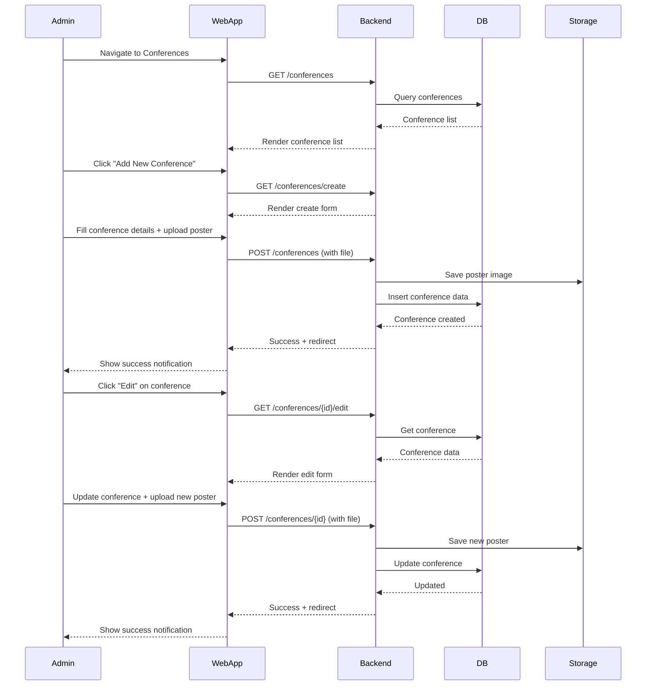
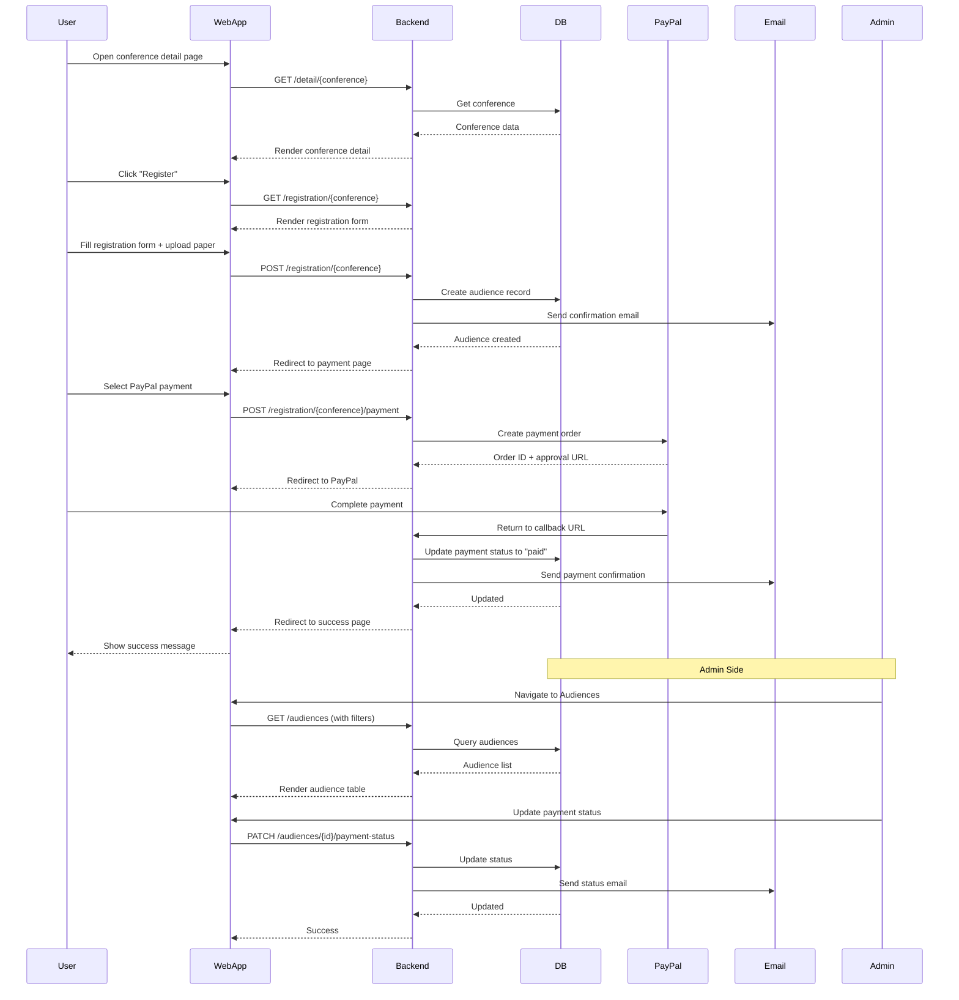
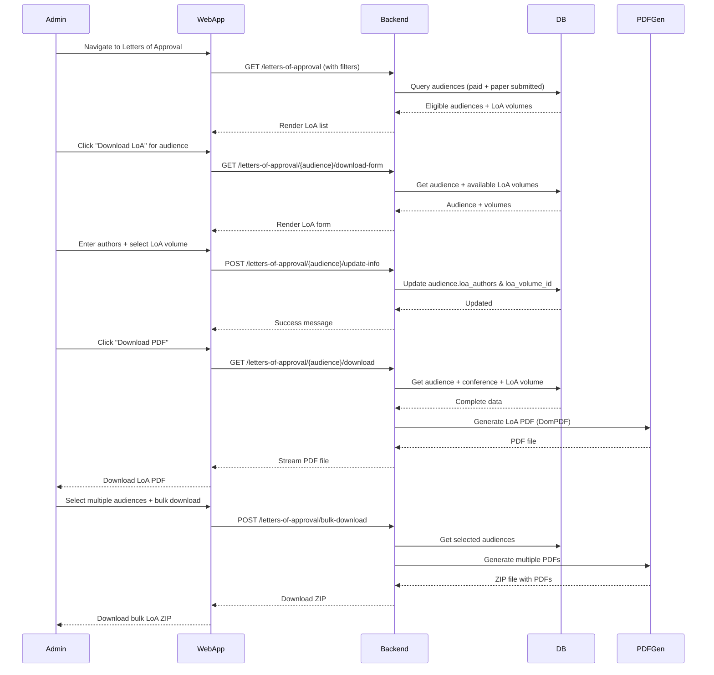
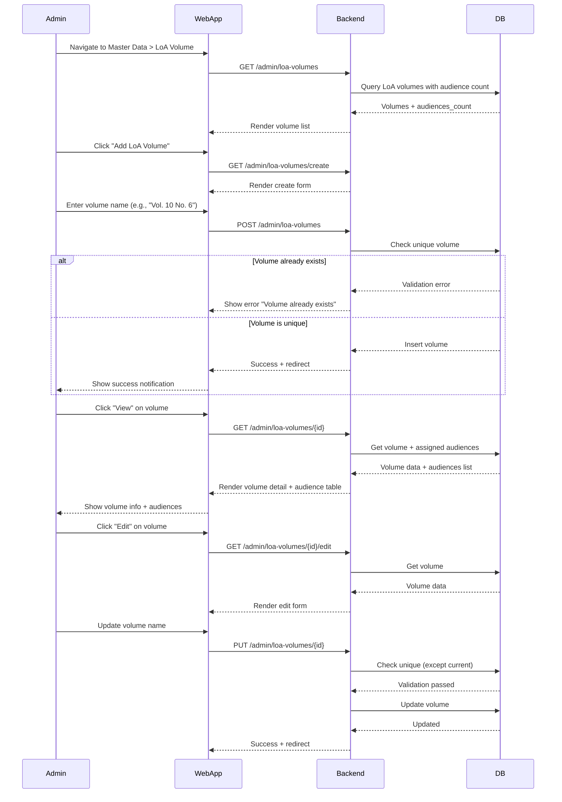
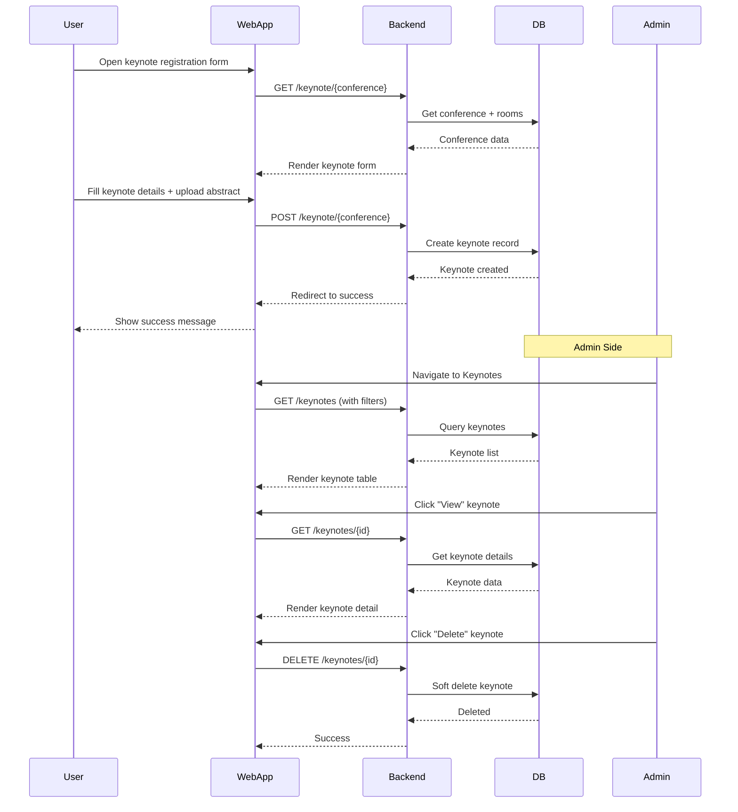
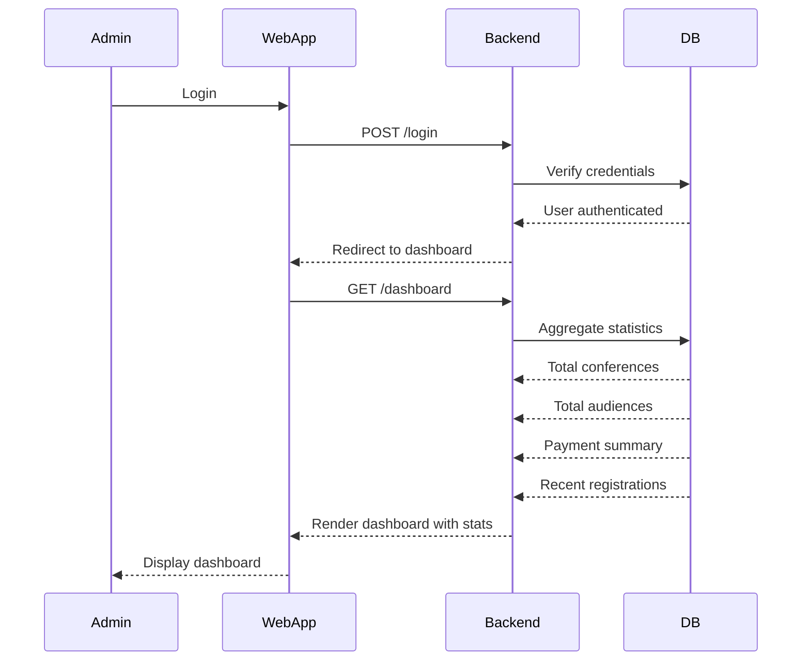

# Conference Management Feature Documentation

## 1. Conference Management

### Description

Admin can create, view, edit, and manage conferences including conference details, settings, rooms, and certificates.

### Key Features

- CRUD operations for conferences
- Upload conference cover/poster
- Configure registration dates, fees, and location
- Manage multiple rooms for each conference
- Upload certificate templates
- Soft delete with restore capability

### Sequence Diagram

### User Flow

1. Admin logs in
2. Navigate to Conferences menu
3. View list of all conferences with search/filter
4. Create new conference with details (name, date, location, fees, rooms)
5. Upload conference poster
6. Configure registration dates
7. Edit/update conference as needed
8. Delete or restore conferences (soft delete)

---

## 2. Audience Registration & Management

### Description

Public users can register for conferences, while admins can view, manage, and verify audience registrations and payments.

### Key Features

- Public registration form
- Payment integration (PayPal, Bank Transfer)
- Payment status management
- Search and filter audiences
- Export audience data to Excel
- Download payment receipts
- View audience details and papers

### Sequence Diagram

### User Flow

1. User visits conference detail page
2. Click register button
3. Fill registration form (name, institution, paper title, etc.)
4. Upload full paper (PDF)
5. Select presentation type and payment method
6. Process payment via PayPal or bank transfer
7. Receive confirmation email
8. Admin verifies payment (for bank transfer)
9. Admin can export data or download receipts

---

## 3. Letter of Approval (LoA) Management

### Description

Admin can generate and manage Letters of Approval for accepted papers, including assigning LoA volumes and downloading PDF letters.

### Key Features

- List eligible audiences (paid + paper submitted)
- Assign LoA volume to audience
- Input author names for LoA
- Generate PDF letter
- Download individual or bulk LoA
- Filter by conference and LoA volume
- Search by participant details

### Sequence Diagram

### User Flow

1. Admin logs in
2. Navigate to Letters of Approval
3. View list of eligible participants (paid + paper submitted)
4. Filter by conference or LoA volume
5. Click "Download Form" for a participant
6. Enter list of authors
7. Select LoA volume from dropdown
8. Submit and approve LoA info
9. Download LoA PDF
10. Optionally bulk download multiple LoA

---

## 4. LoA Volume Management

### Description

Admin can manage LoA volumes as master data, which can be assigned to audiences for their Letters of Approval.

### Key Features

- CRUD operations for LoA volumes
- Search volumes
- View audience count per volume
- View list of audiences assigned to each volume
- Unique volume validation
- Audit trail (created_by, updated_by)

### Sequence Diagram

### User Flow

1. Admin logs in
2. Navigate to Master Data > LoA Volume
3. View list of volumes with audience count
4. Create new volume with unique name
5. Edit existing volume
6. View volume details to see assigned audiences
7. Delete volume if no audiences assigned
8. Search volumes by name

---

## 5. Keynote & Parallel Session Management

### Description

Admin can manage keynote speakers and parallel session submissions from participants.

### Key Features

- View all keynote registrations
- View all parallel session registrations
- Search and filter by conference
- View presenter details and paper info
- Delete submissions
- Export data

### Sequence Diagram

### User Flow (Keynote)

1. User visits conference page
2. Click "Register as Keynote Speaker"
3. Fill form (name, affiliation, bio, abstract)
4. Upload abstract file
5. Select room and time slot
6. Submit form
7. Admin reviews keynote submissions
8. Admin can view, filter, search, or delete

### User Flow (Parallel Session)

- Similar to keynote
- Includes paper title and participant email
- Room assignment
- Admin management via parallel sessions page

---

## 6. Dashboard & Statistics

### Description

Admin dashboard showing overview statistics and recent activities.

### Key Features

- Total conferences count
- Total audiences count
- Total revenue
- Payment status breakdown
- Recent registrations
- Charts and graphs

### Sequence Diagram

### User Flow

1. Admin logs in with credentials
2. Redirected to dashboard automatically
3. View summary cards (conferences, audiences, revenue)
4. View payment status breakdown
5. Navigate to specific features from dashboard menu

---

## Common Features Across All Modules

### Search & Filter

- Real-time search with debouncing (500ms delay)
- Auto-focus on search input
- Filter by conference, status, payment method, etc.
- URL parameter persistence

### Pagination

- Server-side pagination (15, 25, 50, 100 per page)
- PrimeReact DataTable component
- Page navigation controls
- Total records display

### Validation

- Backend: Laravel validation rules
- Frontend: Form error display with Mantine
- Real-time feedback
- Unique constraints enforcement

### UI/UX Consistency

- Mantine UI components
- Card-based layouts
- Badge status indicators
- Action buttons (View, Edit, Delete)
- Success/error notifications
- Responsive design

---

## Tech Implementation Notes

### Backend (Laravel)

- Controllers in `app/Http/Controllers/Admin/`
- Models in `app/Models/`
- Migrations in `database/migrations/`
- Routes in `routes/web.php`
- Eloquent relationships for data integrity

### Frontend (React + TypeScript)

- Pages in `resources/js/Pages/Admin/`
- Components in `resources/js/Components/`
- Inertia.js for SPA experience
- Mantine UI for components
- PrimeReact for data tables

### Database

- Foreign key constraints
- Soft deletes on most tables
- Audit fields (created_by, updated_by)
- Proper indexing for performance
