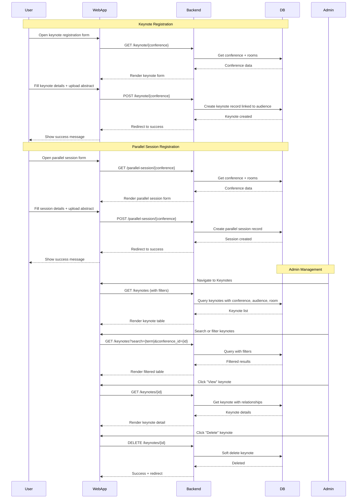

# Keynote & Parallel Session Management Feature

## Description

Admin can manage keynote speaker registrations and parallel session submissions from conference participants.

## Key Features

- View all keynote registrations
- View all parallel session registrations
- Search and filter by conference
- Filter parallel sessions by room
- View presenter details and paper info
- Delete submissions (soft delete)
- Pagination and search functionality

## Sequence Diagram



## User Flow

### Keynote Speaker Registration (Public)

1. User visits conference detail page
2. Click "Register as Keynote Speaker"
3. Fill keynote form:
   - Full name
   - Affiliation/Institution
   - Email
   - Biography
   - Keynote title
   - Abstract
4. Upload abstract file (PDF)
5. Select room and time slot
6. Submit form
7. Receive confirmation

### Parallel Session Registration (Public)

1. User visits conference detail page
2. Click "Submit Parallel Session"
3. Fill session form:
   - Presenter name
   - Paper title
   - Participant email
   - Affiliation
4. Upload abstract file (PDF)
5. Select room
6. Submit form
7. Receive confirmation

### Admin Management (Keynotes)

1. Admin logs in
2. Navigate to Keynotes menu
3. View list with search and filter
4. Filter by conference
5. Search by speaker name, email, title
6. View keynote details
7. Delete if needed

### Admin Management (Parallel Sessions)

1. Admin logs in
2. Navigate to Parallel Sessions menu
3. View list with search and filter
4. Filter by conference or room
5. Search by presenter, paper title, email
6. View session details
7. Delete if needed

## Technical Implementation

### Keynote Management

#### Backend

- **Controller:** `app/Http/Controllers/Admin/KeynoteManagementController.php`
- **Public Controller:** `app/Http/Controllers/KeynoteController.php`
- **Model:** `app/Models/KeyNote.php`
- **Routes:**
  - Admin: `GET /keynotes`, `GET /keynotes/{id}`, `DELETE /keynotes/{id}`
  - Public: `GET /keynote/{conference}`, `POST /keynote/{conference}`

#### Frontend

- **Admin Pages:** `resources/js/Pages/Admin/Keynotes/`
  - `Index.tsx` - List with search, filter, pagination
  - `Show.tsx` - Detail view
- **Public Pages:** `resources/js/Pages/Keynote/`
  - `Create.tsx` - Registration form
  - `Success.tsx` - Success page

#### Database

- **Table:** `key_notes`
- **Fields:**
  - `audience_id` - Foreign key to audiences
  - `full_name`, `affiliation`, `email`
  - `biography`, `keynote_title`
  - `abstract_file_path`
  - `room_id` - Foreign key to rooms
  - `time_slot`
- **Relationships:**
  - `belongsTo(Audience)`
  - `belongsTo(Room)`

### Parallel Session Management

#### Backend

- **Controller:** `app/Http/Controllers/Admin/ParallelSessionManagementController.php`
- **Public Controller:** `app/Http/Controllers/ParallelSessionController.php`
- **Model:** `app/Models/ParallelSession.php`
- **Routes:**
  - Admin: `GET /parallel-sessions`, `GET /parallel-sessions/{id}`, `DELETE /parallel-sessions/{id}`
  - Public: `GET /parallel-session/{conference}`, `POST /parallel-session/{conference}`

#### Frontend

- **Admin Pages:** `resources/js/Pages/Admin/ParallelSessions/`
  - `Index.tsx` - List with search, filter, pagination
  - `Show.tsx` - Detail view
- **Public Pages:** `resources/js/Pages/ParallelSession/`
  - `Create.tsx` - Registration form
  - `Success.tsx` - Success page

#### Database

- **Table:** `parallel_sessions`
- **Fields:**
  - `audience_id` - Foreign key to audiences
  - `presenter_name`, `paper_title`, `participant_email`
  - `affiliation`
  - `abstract_file_path`
  - `room_id` - Foreign key to rooms
- **Relationships:**
  - `belongsTo(Audience)`
  - `belongsTo(Room)`

## Search & Filter Features

### Keynote Search

- Multi-field search across:
  - Full name
  - Email
  - Affiliation
  - Keynote title
  - Conference name (via relationship)

### Parallel Session Search

- Multi-field search across:
  - Presenter name
  - Paper title
  - Participant email
  - Conference name (via relationship)
  - Room name (via relationship)

### Filters

- **Conference:** Dropdown filter by conference
- **Room:** Dropdown filter by room (parallel sessions only)
- Server-side filtering with pagination

## Common Operations

### Create Keynote (Public)

```php
POST /keynote/{conference}
- full_name (required)
- affiliation (required)
- email (required, email format)
- biography (required)
- keynote_title (required)
- abstract_file (required, PDF)
- room_id (required)
- time_slot
```

### Create Parallel Session (Public)

```php
POST /parallel-session/{conference}
- presenter_name (required)
- paper_title (required)
- participant_email (required, email format)
- affiliation
- abstract_file (required, PDF)
- room_id (required)
```

### View Keynote List (Admin)

```php
GET /keynotes?search={term}&conference_id={id}
- Returns paginated keynotes with audience, conference, room
- Supports multi-field search
- Filter by conference
```

### View Parallel Session List (Admin)

```php
GET /parallel-sessions?search={term}&conference_id={id}
- Returns paginated sessions with audience, conference, room
- Supports multi-field search
- Filter by conference and room
```

### Delete Keynote/Session (Admin)

```php
DELETE /keynotes/{id}
DELETE /parallel-sessions/{id}
- Soft delete record
- Returns success message
```

## Validation

### Keynote

- All fields required except time_slot
- Email format validation
- Abstract file must be PDF
- Room must exist

### Parallel Session

- Presenter name, paper title, email required
- Email format validation
- Abstract file must be PDF
- Paper title allows apostrophes (SQL injection prevented)
- Room must exist

## Summary Statistics

### Keynote Index

- **Total:** Count of all keynotes
- **This Month:** Keynotes created in current month
- Filter counts update based on active filters

### Parallel Session Index

- **Total:** Count of all parallel sessions
- **This Month:** Sessions created in current month
- **By Room:** Count grouped by room
- Filter counts update based on active filters
