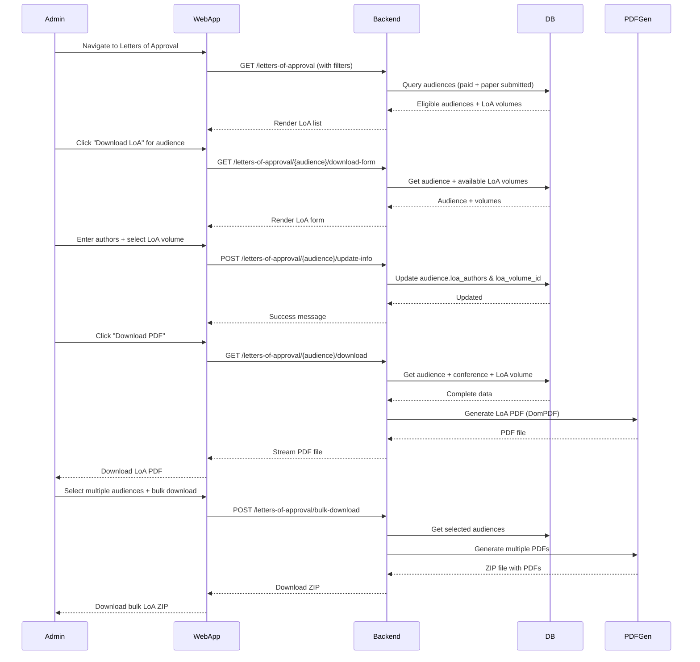

# Letter of Approval (LoA) Management Feature

## Description

Admin can generate and manage Letters of Approval for accepted papers, including assigning LoA volumes and downloading PDF letters.

## Key Features

- List eligible audiences (paid + paper submitted)
- Assign LoA volume to audience
- Input author names for LoA
- Generate PDF letter
- Download individual or bulk LoA
- Filter by conference and LoA volume
- Search by participant details

## Sequence Diagram



## User Flow

1. Admin logs in
2. Navigate to Letters of Approval
3. View list of eligible participants (paid + paper submitted)
4. Filter by conference or LoA volume
5. Search by name, email, institution, or paper title
6. Click "Download Form" for a participant
7. Enter list of authors (comma-separated)
8. Select LoA volume from dropdown
9. Submit and approve LoA info
10. Download LoA PDF
11. Optionally bulk download multiple LoA

## Technical Implementation

### Backend

- **Controller:** `app/Http/Controllers/Admin/LettersOfApprovalController.php`
- **Routes:**
  - `GET /letters-of-approval` - List view
  - `GET /letters-of-approval/{audience}/download-form` - Form
  - `POST /letters-of-approval/{audience}/update-info` - Save LoA info
  - `GET /letters-of-approval/{audience}/download` - Generate PDF
  - `POST /letters-of-approval/bulk-download` - Bulk ZIP
- **PDF Generation:** DomPDF (Barryvdh\DomPDF)

### Frontend

- **Pages:** `resources/js/Pages/Admin/LettersOfApproval/`
  - `Index.tsx` - List with filters (conference, LoA volume, search)
  - `DownloadForm.tsx` - Input form for authors and volume
  - `Show.tsx` - Detail view
- **Components:** Select dropdown for LoA volume, badge for LoA status

### Database

- **Table:** `audiences` (extended fields)
- **LoA Fields:**
  - `loa_status` - pending, approved, rejected
  - `loa_authors` - comma-separated author names
  - `loa_volume_id` - foreign key to loa_volume table
  - `loa_approved_at` - timestamp
  - `loa_notes` - optional admin notes
- **Relationships:**
  - `belongsTo(LoaVolume)` - assigned volume

### PDF Template

- **View:** `resources/views/letters-of-approval/template-clean.blade.php`
- **Includes:**
  - JOIV logo and Scopus analytic badge
  - Participant name and institution
  - Paper title and authors
  - LoA volume information
  - Conference details
  - Approval date and signature
  - Letter number format: `SOTVI/LoA/YEAR/REG_ID`

## Filter & Search

### Filters

- **Conference:** Dropdown filter by conference
- **LoA Volume:** Dropdown filter by assigned volume
- **Search:** Multi-field search across:
  - First name, last name
  - Email
  - Institution
  - Paper title

### Eligibility Criteria

Only audiences with:

- `payment_status = 'paid'`
- `paper_title IS NOT NULL`

## Common Operations

### Update LoA Info

```php
POST /letters-of-approval/{audience}/update-info
- authors (required, max 500 chars)
- loa_volume_id (required, exists in loa_volume table)
- Auto-sets: loa_status='approved', loa_approved_at=now()
```

### Download LoA PDF

```php
GET /letters-of-approval/{audience}/download
- Validates: payment_status='paid', loa_authors & loa_volume_id exist
- Generates PDF with conference and volume info
- Streams PDF file (JOIV-Acceptance-Letter-{name}.pdf)
```

### Bulk Download

```php
POST /letters-of-approval/bulk-download
- audience_ids[] (array of IDs)
- Generates multiple PDFs
- Creates ZIP archive
- Downloads: LoA-Bulk-{date}.zip
```

## LoA Status Badge Colors

- **Pending:** Yellow/Warning
- **Approved:** Green/Success
- **Rejected:** Red/Danger

## LoA Volume Display

- Badge with volume name if assigned
- "Not assigned" text if no volume
- Clickable to filter by volume
