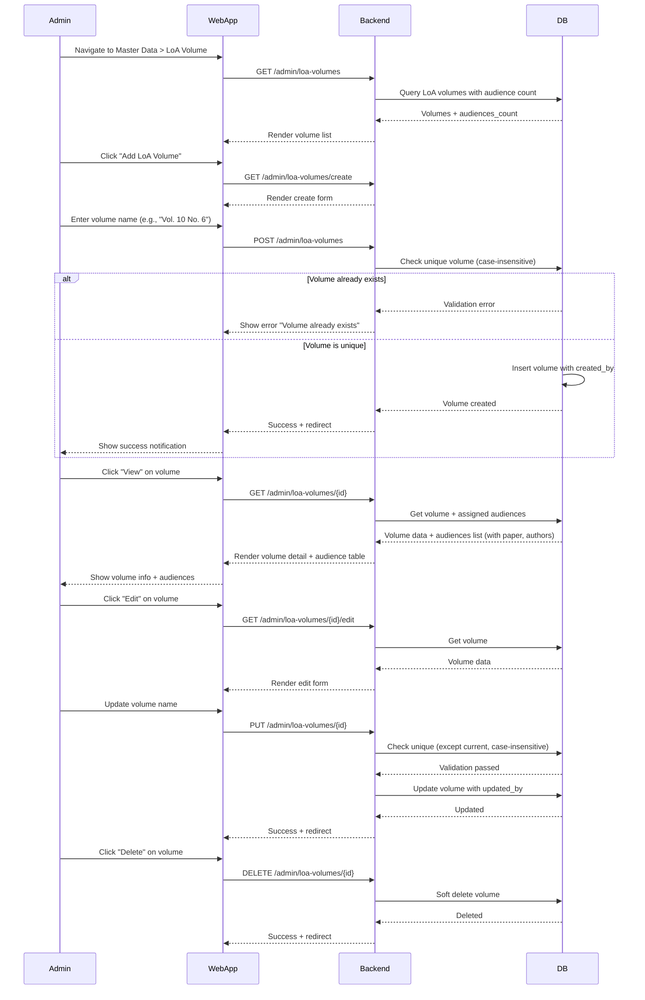

# LoA Volume Management Feature

## Description

Admin can manage LoA volumes as master data, which can be assigned to audiences for their Letters of Approval.

## Key Features

- CRUD operations for LoA volumes
- Search volumes
- View audience count per volume
- View list of audiences assigned to each volume
- Unique volume validation (case-insensitive)
- Audit trail (created_by, updated_by)
- Soft delete capability

## Sequence Diagram



## User Flow

1. Admin logs in
2. Navigate to Master Data > LoA Volume
3. View list of volumes with audience count and search
4. Create new volume with unique name
5. Edit existing volume (unique validation except self)
6. View volume details to see assigned audiences
7. See audience list with paper titles and authors
8. Delete volume if needed (soft delete)
9. Search volumes by name

## Technical Implementation

### Backend

- **Controller:** `app/Http/Controllers/Admin/LoaVolumeManagementController.php`
- **Model:** `app/Models/LoaVolume.php`
- **Routes:**
  - `GET /admin/loa-volumes` - List
  - `GET /admin/loa-volumes/create` - Create form
  - `POST /admin/loa-volumes` - Store
  - `GET /admin/loa-volumes/{id}` - Show
  - `GET /admin/loa-volumes/{id}/edit` - Edit form
  - `PUT /admin/loa-volumes/{id}` - Update
  - `DELETE /admin/loa-volumes/{id}` - Delete
- **Validation:**
  - `volume` required, string, max 255
  - Unique validation (case-insensitive)
  - Custom messages for unique constraint

### Frontend

- **Pages:** `resources/js/Pages/Admin/LoaVolumes/`
  - `Index.tsx` - List with search, pagination, audience count column
  - `Create.tsx` - Create form
  - `Edit.tsx` - Edit form
  - `Show.tsx` - Detail view with assigned audiences table
- **Components:**
  - Search input with auto-focus and debouncing
  - Action buttons (View, Edit, Delete)
  - Summary cards (total volumes, added this month, total audiences)
  - DataTable for audiences in detail view

### Database

- **Table:** `loa_volume`
- **Fields:**
  - `id` - Primary key
  - `volume` - VARCHAR(255), unique
  - `created_by` - Foreign key to users
  - `updated_by` - Foreign key to users
  - `created_at`, `updated_at` - Timestamps
  - `deleted_at` - Soft delete
- **Relationships:**
  - `belongsTo(User, 'created_by')` - creator
  - `belongsTo(User, 'updated_by')` - updater
  - `hasMany(Audience, 'loa_volume_id')` - audiences

## Validation Rules

### Create

```php
POST /admin/loa-volumes
- volume: required|string|max:255|unique:loa_volume,volume
- Auto-set: created_by = Auth::id()
```

### Update

```php
PUT /admin/loa-volumes/{id}
- volume: required|string|max:255|unique:loa_volume,volume,{id}
- Auto-set: updated_by = Auth::id()
```

### Unique Validation

- Case-insensitive check
- Prevents duplicates like "Vol. 10" and "vol. 10"
- Custom error message: "The volume has already been taken."

## Index Page Features

### Summary Statistics

- **Total Volumes:** Count of all volumes
- **Added This Month:** Volumes created in current month
- **Total Audiences:** Sum of all audiences across volumes

### Table Columns

- **Volume:** Volume name/identifier
- **Audiences:** Count of audiences assigned to this volume
- **Created By:** User who created the volume
- **Created At:** Creation date
- **Actions:** View, Edit, Delete buttons

### Search & Pagination

- Real-time search with 500ms debounce
- Auto-focus on search input
- Server-side pagination (15/25/50 per page)
- URL parameter persistence

## Detail Page Features

### Volume Information Card

- Volume name displayed as badge
- Created by and created at
- Updated by and updated at
- Edit and Delete action buttons

### Assigned Audiences Table

- Participant name (first + last)
- Institution
- Paper title (truncated with "...")
- Authors list
- Email
- Conference name
- Empty state if no audiences assigned

## Common Operations

### Create Volume

```php
POST /admin/loa-volumes
{
  "volume": "Vol. 10 No. 6 November 2024"
}
Response: Redirect to index with success message
```

### Update Volume

```php
PUT /admin/loa-volumes/{id}
{
  "volume": "Vol. 10 No. 6 December 2024"
}
Response: Redirect to index with success message
```

### Delete Volume

```php
DELETE /admin/loa-volumes/{id}
Response: Soft delete, redirect back with success message
```

### View Volume Detail

```php
GET /admin/loa-volumes/{id}
Loads: volume, creator, updater, audiences (with conference, paper info)
```

## Navigation Integration

- Located under "Master Data" menu group
- Icon: `IconUsersGroup` (from Tabler Icons)
- Route: `/admin/loa-volumes`
- Name: "LoA Volume"
